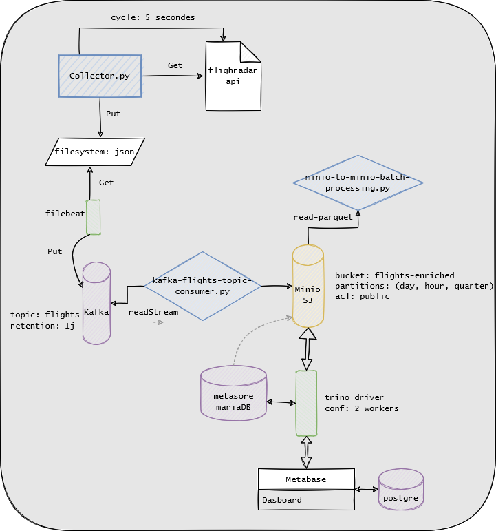

# Presentation

## Cluster configuration



## Prerequisits

Docker must be installed as well as docker-compose tool. The cluster is set to be run on a Linux host with access to internet (to be able to pull the various images from docker registry)
See [Docker](https://docs.docker.com/desktop/install/linux-install/) documentation for installation explanation

## Steps

1. download the repository using git command

```bash
git clone https://github.com/Anghille/flightradar-kata.git
```

2. Go to `/collector` and build the image as `plkata/collector:0.1.0`

```bash
cd flightradar-kata/collector
docker build -t plkata/collector:0.1.0 .
```

3. Go to `flightradar-kata/metabase-plugins/` and build the image `plkata/metabase-enterprise:0.1.0`
```bash
cd flightradar-kata/metabase-plugins
docker build -t plkata/metabase-enterprise:0.1.0 .
```

4. Go to `flightradar-kata` root folder and launch docker-compose

```bash
docker-compose up -d
```

## Dashboards

Various dashboards for monitoring has been setup such as 
1. kafka magic 
2. kafka-control-center
3. minio control-center
4. trino admin UI
5. spark UI
